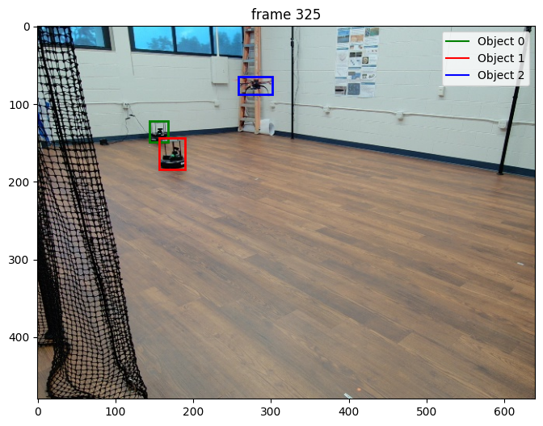

# SAM2 Video Autolabel

This repository contains utilities for automatically labeling videos by processing them into frames and applying various image processing techniques.

The following image is an example of the output of the utilities in this repository:




## Installation

To use these utilities, you need to have the `sam2` repository cloned in your system. You can clone the repository using the following command:

```sh
git clone https://github.com/facebookresearch/sam2.git
```
Follow the instructions in the [`sam2`] repository to set up the environment and install the required dependencies.

Then, clone this repository in the notebook directory of the `sam2` repository. 

Additionally, you need to have [`ffmpeg`]

```sh
sudo apt-get install ffmpeg
```

## Usage

### Placing and Formatting Data

1. **Extracting Frames from Video**:
    - Ensure your video is in a supported format (e.g., `.mp4`).
    - Extract JPEG frames from your video using [`ffmpeg`]
      ```sh
      ffmpeg -i <your_video>.mp4 -r 2 -q:v 2 -start_number 0 <output_dir>/'%05d.jpg'
      ```
      - `-r 2`: Extracts 2 frames per second.
      - `-q:v 2`: Generates high-quality JPEG frames.
      - `-start_number 0`: Starts the JPEG filenames from `00000.jpg`.

2. **Directory Structure**:
    - Place the extracted frames in a directory under the [`videos`] directory in the `sam2` repository.

### Running the Notebook

**Open the Notebook**:
    - Open the [`sam2_video_autolabel.ipynb`] with either Jupyter Notebook with 
        ```sh
        jupyter notebook
        ```
    - Or open it in VSCode with the Python extension installed by following [these instructions](https://code.visualstudio.com/docs/datascience/jupyter-notebooks).

## Additional Information

- **Frame Filenames**: The frames should be named sequentially as `<frame_index>.jpg` (e.g., `00000.jpg`, `00001.jpg`, etc.).
- **Output Directory**: Ensure that the output directory specified in the [`ffmpeg`]

## License

This project is licensed under the MIT License. See the LICENSE file for details.
